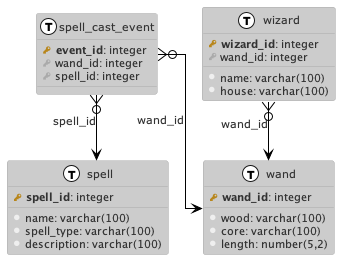

# Instructions

Dear Muggle,
The Ministry of Magic has been secretly tracking all magical spells cast by the wizarding community.
Now that the Aurors have this spell-casting event log, they need you to help them catch some dark wizards!
Use your muggle skills to help stop You-Know-Who, and get us a list of all wizards that used the unforgivable curses.

Complete the `getDarkWizards()` method in the `WizardDaoImpl` class. Inside that method write a query that returns the list of wizards
that used unforgivable curses AND the number of times they cast the spells. Use the injected `jdbcTemplate` to run the query against the database,
parse out the results and return the appropriate object.

The SQL should return:
- list of wizards who cast the spells: 'Avada Kedavra', 'Imperio' & 'Crucio'
- two columns in the result set called `wizard_name` & `spell_cast_count`
- ordered by wizards who crhe most unforgivable spells first

Implement the `WizardResultData` class and use the `resultSet` to populate the list of dark wizards.
Implement the `WizardResultData` class should include:
- Two fields called `wizardName` & `spellCastCount`
- A constructor that accepts both `wizardName` & `spellCastCount` as parameters
- Getters and setters for `wizardName` and `spellCastCount`

# Setup

1. Make sure you have java and docker installed. You can use your preferred IDE or editor.
2. Start the postgres database using docker-compose

`docker-compose up -d db`

3. Run the flyway migrations to create the database schema

`./gradlew flywayMigrate`

4. Tests can be run in your IDE/Editor or using gradle

`./gradlew test`

# Reference

This is the database schema

